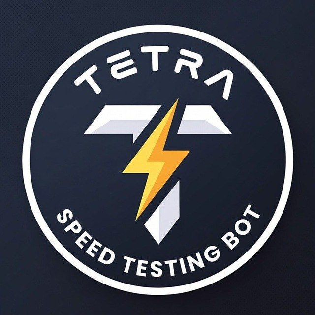
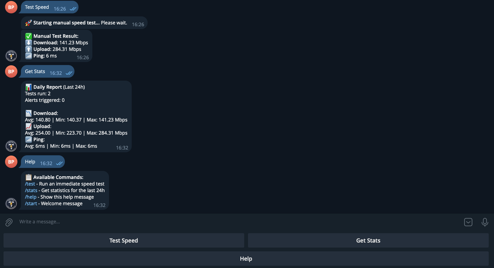

<div align="center">

# Tetra (Time to Restart) 🤖

[](https://github.com/PiterPentester/tetra_bot/actions/workflows/ci.yml)
[](https://golang.org/dl/)


</div>

Tetra is a robust Golang-based Telegram bot designed to run on Single Board Computers (SBCs) like the Orange Pi 5. It continuously monitors your internet connection quality and alerts you when performance drops below acceptable levels.

## Features

- ⏱ **Periodic Speed Tests**: Automatically checks internet speed every 30 minutes (configurable).
- 🚨 **Smart Alerts**: Sends a Telegram notification immediately if Download < 80 Mbps or Upload < 100 Mbps.
- 📊 **Daily Reports & On-Demand Stats**: Sends a summary at 08:00 (Kyiv time) or request it anytime via `/stats` with 24h statistics (Avg/Min/Max speeds, Ping, Alert counts).
- 🎮 **Interactive Control**: Use the built-in keyboard buttons ("Test Speed", "Get Stats") or commands (`/test`, `/stats`) for easy interaction.
- 💾 **Efficiency**: Written in Go, uses minimal resources, stores stats in-memory.
- 🛡 **Resilient**: Retries failed tests, precise error handling, and structured logging.

<div align="center">

</div>

## Prerequisites

- **Hardware**: Orange Pi 5 (or any Linux SBC/Server).
- **OS**: Armbian, Ubuntu, or generic Linux.
- **Telegram Account**: To create the bot and receive notifications.

## 🚀 Getting Started

### 1. Create a Telegram Bot

1. Open Telegram and search for **@BotFather**.
2. Send `/newbot` and follow the instructions to get your **HTTP API Token** (e.g., `123456:ABC-DEF1234ghIkl-zyx57W2v1u123ew11`).
3. Gets your **Chat ID**:
   - Start a conversation with your new bot.
   - Send a message to **@userinfobot** to get your numeric ID (e.g., `123456789`).

### 2. Installation on Orange Pi 5

#### Method A: Build on Device (Recommended if Go is installed)

1. **Install Go 1.24+**:
   ```bash
   wget https://go.dev/dl/go1.24.1.linux-arm64.tar.gz
   sudo rm -rf /usr/local/go && sudo tar -C /usr/local -xzf go1.24.1.linux-arm64.tar.gz
   export PATH=$PATH:/usr/local/go/bin
   ```

2. **Clone and Build**:
   ```bash
   mkdir -p ~/projects
   cd ~/projects
   git clone https://github.com/PiterPentester/tetra_bot.git
   cd tetra_bot
   
   # Build optimized binary
   go build -ldflags "-s -w" -o tetra ./cmd/tetra
   ```

#### Method B: Cross-Compile from PC (Mac/Linux)

Build on your local machine and transfer the binary to the Pi.

```bash
# On your local machine:
GOOS=linux GOARCH=arm64 go build -ldflags "-s -w" -o tetra-linux-arm64 ./cmd/tetra

# Transfer to Pi:
scp tetra-linux-arm64 youruser@orangepi:~/projects/tetra_bot/tetra
```

### 3. Configuration

1. Create the `.env` file:
   ```bash
   cp .env.example .env
   nano .env
   ```

2. Fill in your details:
   ```properties
   TELEGRAM_TOKEN=123456:ABC...
   CHAT_ID=123456789
   DOWNLOAD_THRESHOLD=80.0
   UPLOAD_THRESHOLD=100.0
   CHECK_INTERVAL_MIN=30
   DAILY_REPORT_HOUR=8
   TZ=Europe/Kyiv
   ```

### 4. Running Manually

```bash
./tetra
```

You should see logs indicating the bot has started. Send `/start` to your bot in Telegram to verify connectivity and see the interactive menu.

## 🛠 Systemd Service (Auto-start)

To keep Tetra running in the background and start on boot:

1. **Edit the Service File**:
   Modify `tetra.service` to match your path and username.
   ```bash
   nano tetra.service
   # check User=, WorkingDirectory= and ExecStart= paths
   ```

2. **Install Service**:
   ```bash
   sudo cp tetra.service /etc/systemd/system/
   sudo systemctl daemon-reload
   sudo systemctl enable tetra
   sudo systemctl start tetra
   ```

3. **Check Status**:
   ```bash
   sudo systemctl status tetra
   journalctl -u tetra -f  # Follow logs
   ```

## ☸️ Kubernetes (K3s) Deployment

Tetra is ready for Kubernetes. Since you are running **k3s on Orange Pi 5** (ARM64), follow these steps.

### 1. Build the Docker Image

You need to build the image and make it available to k3s.

> **Note**: A GitHub Actions workflow is configured to automatically build and push the Docker image to GHCR and update the deployment manifest on commits to the `main` branch.

**Option A: Build directly on the Pi (easiest for k3s)**

```bash
# Build the image using Docker
docker build -t tetra:latest .

# Import into k3s (containerd) so it doesn't try to pull from Docker Hub
docker save tetra:latest | sudo k3s ctr images import -
```

**Option B: Cross-compile & Push (from Mac)**

If you have a registry (like GitHub Container Registry or Docker Hub):

```bash
# Enable buildx for multi-arch
docker buildx create --use
docker buildx build --platform linux/arm64 -t youruser/tetra:latest --push .
```
*Note: Update `k8s/deployment.yaml` image to `youruser/tetra:latest` if using this method.*

### 2. Configure Secrets

1. Open `k8s/secrets.yaml`.
2. Replace `your_token_here` and `your_chat_id_here` with your actual values.
   ```yaml
   stringData:
     TELEGRAM_TOKEN: "123456:ABC..."
     CHAT_ID: "123456789"
   ```
   *Note: `stringData` allows you to paste plain text; K8s will base64 encode it automatically.*

### 3. Deploy

```bash
# Apply configuration
kubectl apply -f k8s/configmap.yaml
kubectl apply -f k8s/secrets.yaml

# Deploy application
kubectl apply -f k8s/deployment.yaml
```

### 4. Verify

```bash
kubectl get pods
# NAME                     READY   STATUS    RESTARTS   AGE
# tetra-5d4f7c8b9-xm2w3   1/1     Running   0          20s

kubectl logs -l app=tetra -f
```

## 📂 Project Structure

- `cmd/tetra/`: Main entry point.
- `internal/config/`: Configuration loading.
- `internal/speed/`: Speedtest logic (wrapper around `speedtest-go`).
- `internal/stats/`: In-memory statistics storage.
- `internal/telegram/`: Bot logic and alerting.

## Troubleshooting

- **"Failed to load timezone"**: Ensure `tzdata` is installed on your Linux distro (`sudo apt install tzdata`).
- **Bot not responding**: Check logs. Ensure the token is correct and the bot is not blocked.
- **Speed test failing**: Ensure the device has internet access. The tool uses `speedtest-go` which requires connectivity to find servers.

## License

MIT
